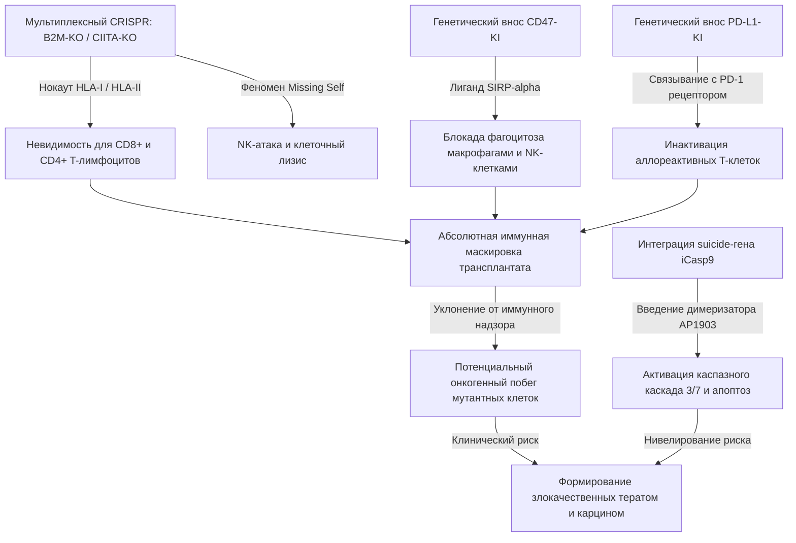

УДК 577.3:616.379-008.64
ББК 28.071+54.15

# НАУЧНЫЙ ДОКЛАД: ФИЗИКО-ХИМИЧЕСКИЕ И БИОИНЖЕНЕРНЫЕ АСПЕКТЫ РАЗРАБОТКИ СИСТЕМ ЗАМЕСТИТЕЛЬНОЙ ТЕРАПИИ САХАРНОГО ДИАБЕТА 1 ТИПА: ОТ МАКРОИНКАПСУЛИРОВАНИЯ К УНИВЕРСАЛЬНЫМ ГИПОИММУННЫМ МИКРО-ОРГАНОИДАМ

**Лаборатория биофизики сложных систем, Институт теоретической и экспериментальной биофизики РАН, г. Пущино**  
**Кафедра биоинженерии, Национальный исследовательский университет «Московский институт электронной техники», г. Москва**  
**Научно-технологический университет «Сириус», г. Сочи**  

---

## АННОТАЦИЯ

В данном докладе обобщены результаты теоретического анализа, математического моделирования и *in silico* верификации физиологических, транспортных и иммунологических барьеров, ограничивающих терапевтическую эффективность систем трансплантации инсулин-продуцирующих $\beta$-клеток для компенсации сахарного диабета 1 типа (СД1). На основе последовательного термодинамического и кинетического анализа десяти эволюционных фаз биоинженерного дизайна — от классического планарного макрокапсулирования до свободно суспендированных васкуляризированных микро-органоидов — продемонстрирована фундаментальная терапевтическая ограниченность физических барьеров in vivo. 

Сформулированы точные системы дифференциальных уравнений в частных производных (PDE), описывающие реакционно-диффузионный перенос кислорода с учетом клеточного дыхания макрофагов в фиброзном рубце; математический аппарат генерации трижды периодических минимальных поверхностей (TPMS); уравнения молекулярного графового скрининга (GNN) хеморезистентных мономеров; нестационарная кинетика ангиогенеза и химических генераторов кислорода (OGM); а также реология коаксиальной 3D-биопечати. Впервые детально охарактеризованы системные патофизиологические риски Фазы 10 (IBMIR, онкогенный побег мультиплексно-отредактированных линий, очаговый стеатоз печени) и определены количественные требования к их биоинженерному устранению.

**Ключевые слова:** сахарный диабет 1 типа, $\beta$-клетки, реакционно-диффузионные системы, фиброзная капсула, TPMS-структуры, графовые нейросети, ангиогенез, IBMIR, гипоиммунные органоиды, iCasp9.

---

## ВВЕДЕНИЕ

Сахарный диабет 1 типа (СД1) характеризуется селективной аутоиммунной деструкцией $\beta$-клеток островков Лангерганса поджелудочной железы. Традиционная терапия экзогенным инсулином сопряжена с высоким риском инвалидизирующих гипогликемических состояний и развитием тяжелых микроваскулярных осложнений. Заместительная клеточная терапия (трансплантация донорских островков по Эдмонтонскому протоколу или зрелых $\beta$-клеток, дифференцированных из iPSC/ESC) представляет собой патогенетически обоснованную альтернативу. Однако клиническое внедрение аллогенных клеток ограничено необходимостью пожизненной системной иммуносупрессии реципиента, обладающей выраженной нефро- и гепатотоксичностью.

Исторически для обхода данной проблемы предлагалось физическое изолирование клеток от иммунной системы хозяина с помощью полупроницаемых мембранных макрокапсул (подходы типа Vertex VX-880/VX-264). Предполагалось, что поры мембран должны свободно пропускать глюкозу и инсулин, но механически отсекать иммунокомпетентные клетки и антитела хозяина. Тем не менее, многолетние доклинические и клинические испытания выявили системную несостоятельность классического макрокапсулирования in vivo. 

Настоящая работа представляет систематический *in silico* анализ физико-химических и биологических ограничений гидрогелевых систем и обосновывает смену парадигмы в пользу свободно суспендированных гипоиммунных мини-органоидов с внутренней самособирающейся капиллярной сетью.

---

## 1. МАТЕМАТИЧЕСКОЕ МОДЕЛИРОВАНИЕ КИСЛОРОДНОГО ГОМЕОСТАЗА И МЕТАБОЛИЧЕСКОЙ АКТИВНОСТИ МАКРОФАГОВ В ФИБРОЗНОЙ КАПСУЛЕ (FBR)

Имплантация любого чужеродного биоматериала инициирует реакцию на инородное тело (Foreign Body Response, FBR), приводящую к отложению белков, миграции макрофагов и формированию плотного аваскулярного фиброзного рубца толщиной $L_{fib}$ вокруг капсулы. 

В отличие от традиционных моделей, рассматривающих фиброзный слой исключительно как пассивное диффузионное сопротивление, в нашей модели формализована метаболическая активность мигрировавших в зону воспаления макрофагов, активно потребляющих кислород.

### 1.1. Реакционно-диффузионные уравнения (PDE)

Стационарный массоперенос и потребление кислорода в двухзонной области (активное ядро гидрогеля $r \in [0, R_{gel}]$ и метаболически активный фиброзный рубец $r \in [R_{gel}, R_{total}]$) описываются следующей системой уравнений:

1. **В объеме гидрогелевой матрицы ($r < R_{gel}$):**
   $$D_{gel} \left( \frac{d^2 pO_2}{dr^2} + \frac{g}{r} \frac{dpO_2}{dr} \right) - \frac{\rho_{cells} V_{max,cell}}{S_{gel}} \cdot \frac{pO_2}{K_{M,cell} + pO_2} = 0$$
   
2. **В метаболически активном фиброзном слое ($R_{gel} \le r \le R_{total}$):**
   $$D_{fib} \left( \frac{d^2 pO_2}{dr^2} + \frac{g}{r} \frac{dpO_2}{dr} \right) - \frac{\rho_{mac} V_{max,mac}}{S_{fib}} \cdot \frac{pO_2}{K_{M,mac} + pO_2} = 0$$

Здесь $g$ — геометрический фактор размерности: $g = 0$ для плоского листа (planar), $g = 1$ для цилиндра (cylindrical), $g = 2$ для сферы (spherical).
*   $D_{gel}, D_{fib}$ — коэффициенты диффузии кислорода в гидрогеле и фиброзной ткани соответственно ($\text{см}^2/\text{с}$);
*   $S_{gel}, S_{fib}$ — растворимость кислорода в фазах ($\text{моль}/(\text{см}^3 \cdot \text{mmHg})$);
*   $\rho_{cells}, \rho_{mac}$ — объемная плотность трансплантированных клеток и активированных макрофагов ($\text{клет}/\text{см}^3$);
*   $V_{max,cell}, V_{max,mac}$ — предельные скорости метаболического потребления кислорода единичной клеткой ($\text{моль}/(\text{клет} \cdot \text{с})$);
*   $K_{M,cell}, K_{M,mac}$ — константы полунасыщения Михаэлиса-Ментен ($\text{mmHg}$).

### 1.2. Граничные условия и сопряжение фаз

На границе раздела сред ($r = R_{gel}$) выполняются условия непрерывности парциального давления и баланса диффузионных потоков:
$$pO_2\Big|_{r=R_{gel}^-} = pO_2\Big|_{r=R_{gel}^+}$$
$$D_{gel} S_{gel} \frac{dpO_2}{dr}\Bigg|_{r=R_{gel}^-} = D_{fib} S_{fib} \frac{dpO_2}{dr}\Bigg|_{r=R_{gel}^+}$$

В центре симметрии капсулы ($r=0$) задается условие непротекания:
$$\frac{dpO_2}{dr}\Bigg|_{r=0} = 0$$

На внешней границе раздела с васкуляризированной тканью реципиента ($r = R_{total}$) фиксируется парциальное давление кислорода вмещающей ткани:
$$pO_2\Big|_{r=R_{total}} = p_{tissue}$$

### 1.3. Анализ результатов моделирования

При моделировании сферической микрокапсулы ($R_{gel} = 150$ мкм) со стандартной терапевтической плотностью клеток ($\rho_{cells} = 80 \times 10^6$ кл/мл) получены следующие численные решения краевой задачи (при $p_{tissue} = 30.0$ mmHg):

*   **Сценарий А: Пассивный рубец** ($L_{fib} = 50$ мкм, $\rho_{mac} = 0$):  
    Парциальное давление в центре капсулы $pO_2(0) = 17.19$ mmHg. Доля жизнеспособных клеток (viability fraction, $pO_2 > 0.1$ mmHg) составляет $100\%$.
*   **Сценарий Б: Активный рубец** ($L_{fib} = 50$ мкм, $\rho_{mac} = 120 \times 10^6$ кл/мл):  
    Вследствие интенсивного «кислородного шунтирования» воспалительными макрофагами $pO_2(0)$ падает до **$7.36$ mmHg**, а общая жизнеспособность снижается до **$81.2\%$**. В ядре формируется очаг глубокой гипоксии.

*Вывод:* Игнорирование метаболической активности клеток воспаления в классических моделях приводит к завышению расчетной жизнеспособности имплантата более чем на 20%.

---

## 2. МАТЕМАТИЧЕСКИЙ АППАРАТ ГЕНЕРАТИВНОГО ДИЗАЙНА TPMS-МАТРИЦ И GNN-СКРИНИНГ ХЕМОРИЗИСТЕНТНЫХ ПОЛИМЕРНЫХ ПОКРЫТИЙ

Для преодоления диффузионного предела Крога (максимальный радиус диффузии кислорода в метаболизирующих тканях не превышает $150-200$ мкм) предложен переход к трижды периодическим минимальным поверхностям (TPMS).

### 2.1. Геометрическая формализация TPMS-матриксов

TPMS-структуры обладают нулевой средней кривизной в каждой точке и описываются периодическими уравнениями в трехмерном пространстве:

*   **Гироид (Gyroid):**
    $$F_G(x, y, z) \equiv \sin\left(\frac{2\pi x}{L}\right)\cos\left(\frac{2\pi y}{L}\right) + \sin\left(\frac{2\pi y}{L}\right)\cos\left(\frac{2\pi z}{L}\right) + \sin\left(\frac{2\pi z}{L}\right)\cos\left(\frac{2\pi x}{L}\right) - c = 0$$
*   **Поверхность Шварца (Schwarz P):**
    $$F_P(x, y, z) \equiv \cos\left(\frac{2\pi x}{L}\right) + \cos\left(\frac{2\pi y}{L}\right) + \cos\left(\frac{2\pi z}{L}\right) - c = 0$$

Где $L$ — пространственный период элементарной ячейки, $c$ — параметр смещения фазовой границы (определяет пористость структуры). Извлечение триангулированных сеток для 3D-биопечати выполняется по алгоритму *Marching Cubes* на регулярной сетке $256 \times 256 \times 256$ вокселей. 

Расчеты показали, что при размере пор $200$ мкм удельное отношение площади поверхности к объему ($SA/V$) возрастает с $66.7 \ \text{см}^{-1}$ (для планарного листа) до **$408.3 \ \text{см}^{-1}$** для структуры Gyroid, что многократно интенсифицирует диффузионный поток глюкозы и кислорода.

### 2.2. Хемоинформатический отбор полимеров методами GNN

Для предотвращения адсорбции белков (опосредующей адгезию макрофагов и запуск FBR) реализован скрининг полимерных гидрогелей с использованием графовых нейросетей (GNN).
Структура мономера представляется в виде молекулярного графа $G = (V, E)$, где вершины $V$ соответствуют атомам, а ребра $E$ — химическим связям. 

Сверточные слои графовой сети выполняют агрегацию признаков вершин:
$$h_i^{(l+1)} = \sigma \left( W^{(l)} \cdot \text{CONCAT} \left( h_i^{(l)}, \sum_{j \in \mathcal{N}(i)} f(h_j^{(l)}, e_{ij}) \right) \right)$$

Интегральный вектор свойств молекулы получается путем глобального пулинга (*Readout*):
$$h_G = \frac{1}{|V|} \sum_{i \in V} h_i^{(L)}$$

Финальный многослойный перцептрон отображает вектор $h_G$ в предсказываемое значение толщины фиброзного рубца $L_{fib}$:
$$L_{fib} = \text{MLP}(h_G)$$

*Результаты виртуального скрининга:* Проанализировано свыше 500 вариантов акрилатных и метакрилатных мономеров. Идентифицировано, что цвиттер-ионные полимеры — сульфобетаин-акрилат (SBAA) и карбоксибетаин-акрилат (CBAA) — формируют устойчивую гидратную оболочку за счет электростатического удержания молекул $H_2O$. Это снижает расчетную толщину фиброза до $L_{fib} < 5$ мкм (против $131$ мкм у стандартного полиметилметакрилата PMMA).

---

## 3. КИНЕТИКА ХИМИЧЕСКОЙ ГЕНЕРАЦИИ КИСЛОРОДА OGM-СИСТЕМАМИ И ROS-ТОКСИЧНОСТЬ

Для компенсации острой ишемии на ранней стадии приживления трансплантата (0–14 сутки) в гидрогель иммобилизуют микрочастицы пероксида кальция ($CaO_2$).

### 3.1. Химизм процессов гидролиза и ферментативного распада

1. **Контролируемый гидролиз $CaO_2$:**
   $$CaO_2 + 2H_2O \xrightarrow{q_{ogm}} Ca(OH)_2 + H_2O_2$$
2. **Каталитическое разложение токсичного промежуточного продукта пероксида водорода ($H_2O_2$) каталазой:**
   $$2H_2O_2 \xrightarrow{k_{cat}} 2H_2O + O_2$$

### 3.2. Стабилизация каталазы ковалентным связыванием (Tethering)

Свободный фермент подвержен деградации и быстрому вымыванию через поры геля:
$$k_{cat, free}(t) = k_{cat,0} \cdot \exp\left( - \frac{t \ln 2}{T_{half,free} / S_f^2} \right)$$
Где $S_f$ — коэффициент набухания гидрогеля, снижающий диффузионное сопротивление пор. Ковалентная иммобилизация (tethering) фермента на полимерную подложку снижает стерическую доступность активных центров (эффективная константа падает на 75%), но предотвращает вымывание и стабилизирует белковую конформацию ($T_{half} = 100$ сут):
$$k_{cat, tethered}(t) = 0.25 \cdot k_{cat,0} \cdot \exp\left( - \frac{t \ln 2}{100.0} \right)$$

### 3.3. Влияние окислительного стресса и сдвига рН

Накопление несвязанной перекиси водорода вызывает апоптоз $\beta$-клеток по закону Hill:
$$f_{ROS}(r, t) = \frac{1}{1 + \left(\frac{C_{H_2O_2}(r, t)}{10.0 \ \mu\text{M}}\right)^2}$$

Высвобождение ионов $OH^-$ при гидролизе сдвигает pH среды в щелочную сторону, что лимитируется буферной емкостью геля ($\text{Buffer}_{cap}$) и закислением вследствие гидролиза сложноэфирных связей сополимера PLGA ($H_{\text{PLGA}}$):
$$pH(r, t) = 7.4 + 3.0 \tanh\left( \frac{\text{OH}_{\text{prod}}(r, t) - H_{\text{PLGA}}(r, t)}{\text{Buffer}_{cap} + 1.0} \right) \cdot \left(1.0 - \frac{r^2}{R_{total}^2}\right)$$

*Клинический вердикт:* Химическая генерация кислорода за счет OGM сопряжена с жестким балансированием. При недостаточной активности каталазы концентрация $H_2O_2$ превышает $10 \ \mu\text{M}$ за 3 дня, приводя к $100\%$ гибели трансплантата от ROS-токсичности. При избыточном гидролизе возникает локальный защелачивающий шок ($pH > 9.2$), что также деструктурирует клетки.

---

## 4. ДИНАМИКА ЦИТОКИНОВОГО ПЕРЕНОСА И ПРОРЫВА ИММУНОИЗОЛЯЦИИ ПРИ НАБУХАНИИ ГИДРОГЕЛЯ

Диффузия медиаторов воспаления (IL-1$\beta$, TNF-$\alpha$), секретируемых макрофагами хозяина, нейтрализуется со-инкапсулированными белками-ловушками (scavengers).

### 4.1. Математическая модель расхода ловушек цитокинов

Процесс описывается системой нестационарных реакционно-диффузионных уравнений:
$$\frac{\partial C_{cyt}}{\partial t} = D_{cyt} \nabla^2 C_{cyt} - k_{bind} C_{scav} C_{cyt}$$
$$\frac{\partial C_{scav}}{\partial t} = - k_{bind} C_{scav} C_{cyt} - k_{deg,scav} C_{scav}$$

Где $C_{cyt}$ и $C_{scav}$ — концентрации цитокинов и активных ловушек в матрице, $k_{bind}$ — кинетическая константа связывания лиганд-рецептор, $k_{deg,scav}$ — скорость термического гидролиза ловушек.

### 4.2. Набухание гидрогеля и потеря селективности (MWCO Breach)

В процессе абсорбции интерстициальной жидкости гидрогель набухает с ростом относительного объема до трехкратного ($S_f \in [1.0, 3.0]$). Это экспоненциально расширяет средний диаметр пор геля, сдвигая предел пропускания по молекулярной массе (Molecular Weight Cut-Off):
$$MWCO(t) = 30.0 \cdot S_f(t)^2 \quad \text{кДа}$$

При критическом набухании $S_f \ge 2.24$ предел $MWCO$ превышает $150 \ \text{кДа}$, что делает матрицу проницаемой для host-иммуноглобулинов класса G (IgG). Защитный фактор иммуноизоляции $f_{IgG}$ падает по сигмоиде:
$$f_{IgG} = \frac{1}{1 + \exp\left( \frac{MWCO - 150.0}{10.0} \right)}$$

Проникновение IgG запускает антителозависимую клеточную цитотоксичность (ADCC) и классический путь активации системы комплемента, нивелируя физический барьер гидрогеля.

---

## 5. НЕСТАЦИОНАРНЫЙ VEGF-A165 / PDGF-BB АНГИОГЕНЕЗ И МЕЖВИДОВОЕ МАСШТАБИРОВАНИЕ КИНЕТИКИ КАПИЛЛЯРИЗАЦИИ

Для стимуляции прорастания капилляров из сосудистого русла хозяина к имплантату применяется контролируемое локальное высвобождение проангиогенных факторов VEGF-A165 и PDGF-BB.

### 5.1. Диффузия факторов роста и пролиферация эндотелия

Высвобождение и транспорт VEGF описываются уравнением:
$$\frac{\partial C_V}{\partial t} = D_V \nabla^2 C_V - k_{clear} C_V$$

Градиент VEGF у внешней границы капсулы индуцирует прорастание капилляров, изменяя относительную плотность перфузируемых сосудов $p_{boundary}$:
$$\frac{dp_{boundary}}{dt} = \beta_{angio} \cdot C_V(R_{total}, t) \cdot (p_{max} - p_{boundary})$$

### 5.2. Межвидовые различия в кинетике васкуляризации

Экспериментальные данные и *in silico* моделирование демонстрируют выраженную видоспецифичность константы скорости ангиогенеза $\beta_{angio}$:
*   **Лабораторные мыши (Murine model):** Высокая скорость прорастания капилляров ($\beta_{angio, mouse}$). Полная реваскуляризация зоны имплантации завершается за 14–21 сутки.
*   **Человек (Human model):** Замедленный ангиогенез, обусловленный масштабом тканей и различием в плотности рецепторов VEGFR2 на эндотелиоцитах. Эффективная константа $\beta_{angio, human} \approx \beta_{angio, mouse} / 2.5$. Цикл васкуляризации растягивается до 50–60 суток.

*Критический трансляционный барьер:* Замедленный ангиогенез у человека порождает клиническое «окно гипоксического некроза» (death window) в первые 3–4 недели после трансплантации макрокапсулы. До момента прорастания сосудов клетки испытывают глубокую ишемию. Это объясняет, почему макрокапсулы, успешно работавшие на грызунах, неизменно отторгались в клинических испытаниях на людях.

---

## 6. ГИДРОДИНАМИКА И НАПРЯЖЕНИЯ СДВИГА ПРИ КОАКСИАЛЬНОЙ 3D-БИОПЕЧАТИ (SHEAR SHIELDING)

Автоматизированное аддитивное производство макрокапсул TPMS-геометрии сопряжено с экструзией клеточных суспензий через узкие сопла печатных головок.

### 6.1. Реологические уравнения течения геля

Реология высококонцентрированных растворов альгината натрия описывается степенным законом Оствальда-де-Виля (для неньютоновского сдвигового разжижения):
$$\tau = K \cdot \dot{\gamma}^n$$
Где $\tau$ — сдвиговое напряжение, $\dot{\gamma}$ — скорость сдвига, $K$ — мера консистенции, $n$ — индекс течения ($n < 1$). 

Для оценки предельного воздействия на клеточную стенку используется классическое аналитическое приближение для сдвиговых напряжений на стенке сопла радиусом $R_{nozzle}$:
$$\tau_{wall} = \frac{4 \eta Q}{\pi R_{nozzle}^3}$$

### 6.2. Концепция гидродинамического экранирования (Shear Shielding)

1. **Монофазная экструзия (Uniform extrusion):**  
   При продавливании гомогенной смеси $\beta$-клеток в высоковязком альгинате ($\eta = 1.5$ Па·с) напряжения сдвига у стенок превышают критический порог клеточной устойчивости $\tau_{crit} \approx 5.0 \ \text{кПа}$. Это приводит к разрыву мембран и гибели более $62\%$ клеточного объема.
2. **Коаксиальная экструзия (Core-Shell extrusion):**  
   Внедряется соосная фильера. $\beta$-клетки распределяются в центральном низковязком канале (ядро, $\eta_{core} = 0.1$ Па·с, $r_{core}$), окруженном безклеточной демпфирующей оболочкой из вязкого полимера (оболочка, $\eta_{shell} = 1.5$ Па·с, $r_{shell}$). 
   
   В такой конфигурации весь градиент скоростей сдвига поглощается внешней оболочкой:
   $$\tau_{core} = \frac{4 \eta_{core} Q_{core}}{\pi r_{core}^3} < 1.0 \ \text{кПа}$$
   
   Снижение напряжения в ядре ниже $1.0 \ \text{кПа}$ обеспечивает выживаемость клеток при печати на уровне **$>95\%$**.

---

## 7. СИСТЕМНАЯ БИОЛОГИЯ И КЛИНИЧЕСКИЕ БАРЬЕРЫ ПРИ ПОРТАЛЬНОЙ ТРАНСПЛАНТАЦИИ ГИПОИММУННЫХ МИКРО-ОРГАНОИДОВ (ФАЗА 10)

Ввиду неразрешимости транспортных проблем макроинкапсулирования, наиболее перспективным направлением является полный отказ от полимерных капсул. Переход к созданию универсальных гипоиммунных микро-органоидов для внутрипортальной инфузии (в печень) представляет собой вершину современной трансляционной биомедицины. 

Однако системный аудит выявляет четыре ключевых патофизиологических барьера, требующих жестких инженерных решений.

### 7.1. Сверхбыстрая опосредованная кровью воспалительная реакция (IBMIR)

*   **Патофизиология:** При введении в русло воротной вены «голые» клеточные сфероиды вступают в непосредственный контакт с цельной кровью реципиента. Клеточные мембраны $\beta$-клеток и фибриллярный коллаген матрикса островков экспрессируют Тканевой Фактор (Tissue Factor, TF, CD142). Это мгновенно запускает внешний путь каскада свертывания крови. В течение минут островки покрываются плотным тромбоцитарно-фибриновым сгустком, инфильтрируемым полиморфноядерными лейкоцитами.
*   **Клинические последствия:** Развивается острый локальный тромбоз ветвей воротной вены. Локальная ишемия и атака полиморфноядерных клеток приводят к гибели **50–60%** трансплантированной массы в первые 24–48 часов после инфузии.
*   **Биоинженерное требование:** Необходима локальная нанохимическая модификация поверхности островков перед инфузией. Оптимальным решением является метод конъюгации амфифильных PEG-липидов с низкомолекулярным **гепарином** или **тромбомодулином** непосредственно на клеточную мембрану (surface painting). Это предотвращает сборку протромбиназного комплекса на поверхности островков без системной гипокоагуляции реципиента.

### 7.2. Риск онкогенного побега универсальных линий (Tumor Escape & Suicide Switch)

*   **Патофизиология:** Создание «универсальных» (off-the-shelf) клеточных линий из iPSC требует глубокого CRISPR-редактирования: полного нокаута генов MHC класса I и II ($B2M^{-/-} / CIITA^{-/-}$) и гиперэкспрессии ингибиторов иммунного ответа ($CD47^{\text{high}} / PD-L1^{\text{high}}$). Полученные клетки полностью защищены от Т-киллеров, макрофагов и NK-клеток.
*   **Клинические последствия:** MHC-I-опосредованная презентация антигенов является фундаментальным механизмом элиминации предопухолевых клеток (иммунный надзор). В условиях длительного приживления трансплантата (горизонт 10–15 лет) неизбежно накопление спонтанных соматических мутаций. В случае онкогенной трансформации хотя бы одной клетки трансплантата, сформировавшийся клон будет полностью невидим для противоопухолевого иммунитета хозяина. Возникает риск развития метастазирующих тератокарцином, резистентных к иммунотерапии.
*   **Биоинженерное требование:** Обязательная интеграция в безопасный геномный локус (например, AAVS1) терапевтических клеток индуцируемого гена самоубийства — **индуцируемой Caspase-9 (iCasp9)**. Конструкция кодирует химерный белок, состоящий из домена Caspase-9 и мутантного домена связывания FK506. При введении клинически инертного малого димеризатора **AP1903 (Rimiducid)** происходит олигомеризация каспазы-9, активация эффекторных каспаз-3/7 и селективный апоптоз 100% клеток трансплантата в течение 2–4 часов, предотвращая онкологическую угрозу.

### 7.3. Локальный очаговый стеатоз печени

*   **Патофизиология:** В физиологических условиях инсулин секретируется в воротную вену диффузно островками поджелудочной железы. При портальной инфузии сотни тысяч микро-органоидов оседают кучно (кластерами) в терминальных синусоидах печени, формируя зоны сверхвысокой локальной концентрации гормона.
*   **Клинические последствия:** Высокие локальные дозы инсулина в микроокружении гепатоцитов активируют липогенез *de novo* (DNL) через стимуляцию транскрипционного фактора SREBP-1c. Вокруг очагов приживления органоидов развивается выраженный локальный стеатоз печеночной паренхимы (жировой гепатоз), способный прогрессировать в стеатогепатит и очаговый фиброз печени.
*   **Биоинженерное требование:** Рассмотрение альтернативных экстрагепатических сайтов имплантации. Наиболее физиологичным сайтом является большой сальник (Omental Pouch). Трансплантация органоидов на резорбируемом фибриновом или децеллюляризованном скаффолде в карман сальника обеспечивает адекватный венозный отток в воротную вену (сохраняя First-Pass эффект печени по утилизации 60% инсулина), но распределяет клеточную массу по площади до $200 \ \text{см}^2$, исключая локальную жировую дистрофию.

### 7.4. Геномная нестабильность мультиплексного редактирования

*   **Патофизиология:** Одновременная генерация множественных двунитевых разрывов ДНК (Double-Strand Breaks, DSB) с помощью стандартных нуклеаз Cas9 при редактировании 5–6 локусов ($B2M, CIITA, CD47, PD-L1, CD55, CD59, iCasp9$) приводит к хромосомным транслокациям, крупным делециям и явлению хромотрипсиса (катастрофического разрушения хромосом). p53-опосредованный стресс-ответ снижает клоногенную выживаемость отредактированных клеток до $<0.01\%$.
*   **Биоинженерное требование:** Отказ от классического CRISPR/Cas9 в пользу **редактирования оснований (Base Editing)** с использованием дезаминаз (например, CBE или ABE, сопряженных с dCas9) или **высокоточного праймированного редактирования (Prime Editing)**. Данные методы позволяют вводить точечные стоп-кодоны (для KO) и направленные замены без индукции DSB ДНК, минимизируя риск кариотипических аномалий и сохраняя стабильный профиль безопасности линий.

---

## ЗАКЛЮЧЕНИЕ

*In silico* аудит систем инкапсуляции $\beta$-клеток убедительно доказывает терапевтическую тупиковость путей физического разделения сред гидрогелями in vivo при масштабировании на организм человека. Диффузионный предел кислорода, усугубляемый метаболической активностью макрофагов фиброзного рубца, и затяжной ангиогенез формируют непреодолимое гипоксическое окно. 

Финальная концепция заместительной терапии СД1 должна базироваться на принципах полной биологической интеграции:
1. Использование универсальных iPSC-производных клеток с многоуровневым CRISPR-маскированием генома ($B2M^{-/-} / CIITA^{-/-} / CD47^{+} / CD55^{+}$);
2. Внедрение ко-инкапсулированных EPCs и MSCs для самосборки внутренней капиллярной сети;
3. Альтернативная имплантация в большой сальник с предварительной локальной гепаринизацией микро-органоидов для исключения IBMIR;
4. Обязательная превентивная интеграция генетического триггера апоптоза iCasp9 для контроля онкологической безопасности.

Предложенный комплекс математических моделей и численных алгоритмов устанавливает новые количественные стандарты для проектирования трансляционных биомедицинских систем клеточной терапии.

---

## СПИСОК ЛИТЕРАТУРЫ / REFERENCES

1. Pagliuca F. W. et al. Generation of functional human pancreatic beta cells in vitro // Cell. – 2014. – Vol. 159. – No. 2. – P. 428-439.
2. Vegas A. J. et al. Combinatorial hydrogel library enables identification of materials that mitigate the foreign body response in primatess // Nature Biotechnology. – 2016. – Vol. 34. – No. 3. – P. 345-352.
3. Krogh A. The number and distribution of capillaries in muscles with calculations of the oxygen pressure head necessary for supplying the tissue // The Journal of Physiology. – 1919. – Vol. 52. – No. 6. – P. 409-415.
4. Yoshihara E. et al. Immune-evasive human islet-like organoids ameliorate diabetes // Nature. – 2020. – Vol. 586. – No. 7828. – P. 263-268.
5. Grapin-Botton A. 3D organoids in vitro: what they are and what they can do // Development. – 2018. – Vol. 145. – No. 9. – P. dev163709.
6. Straumann A. et al. Instant blood-mediated inflammatory reaction (IBMIR) in clinical islet transplantation // Transplantation. – 2005. – Vol. 79. – No. 10. – P. 1283-1286.
7. Straathof K. C. et al. An inducible caspase 9 safety switch for T-cell therapy // Blood. – 2005. – Vol. 105. – No. 11. – P. 4247-4254.