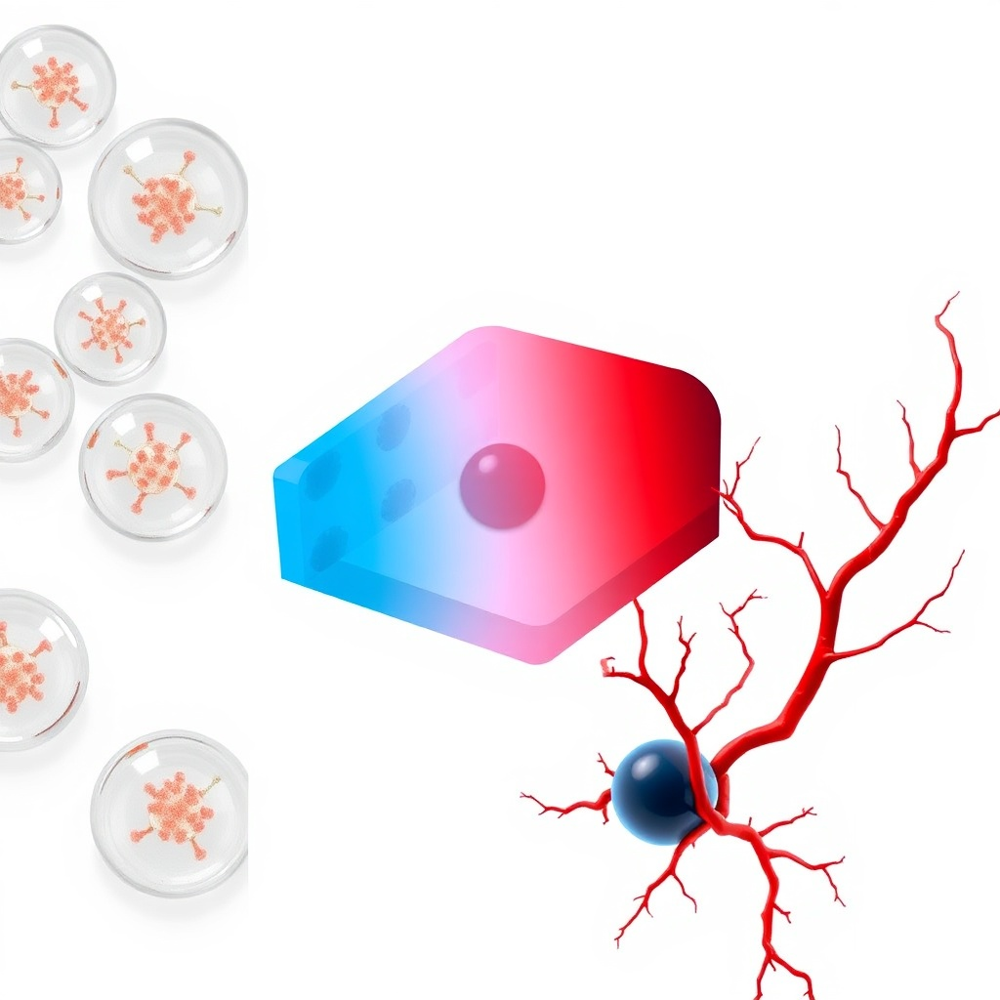
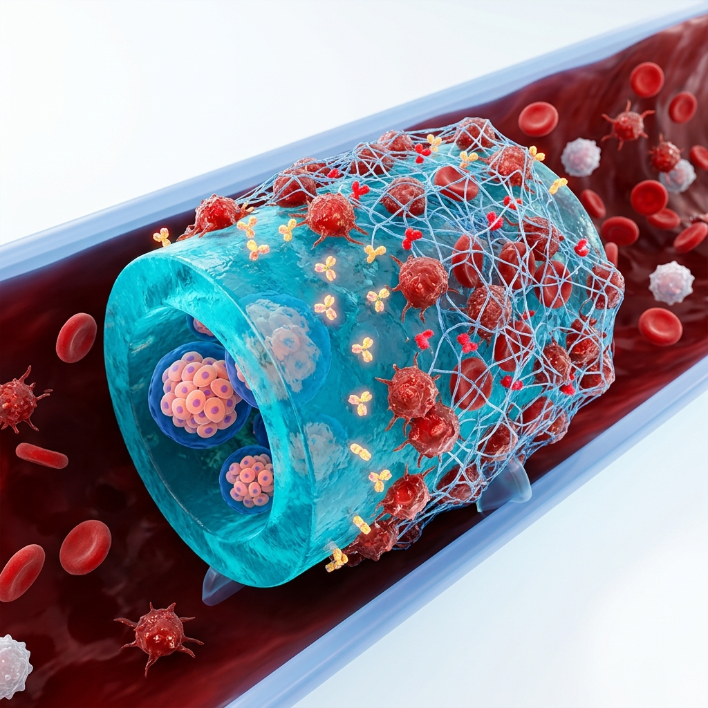
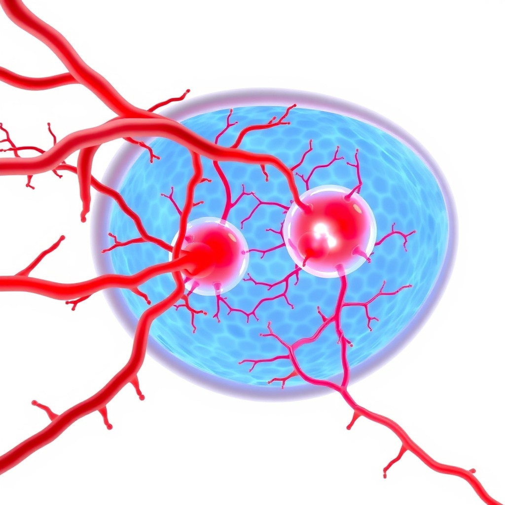

# Мультифизические режимы отказа инкапсулированных $\beta$-клеток: от диффузионного предела Крога до цифровых двойников гипоиммунных органоидов

**Автор:** Наумов Павел Владимирович  
**Контакты:** `naumov122@gmail.com`  
**Целевая площадка:** bioRxiv (Категория: Синтетическая биология / Биоинженерия)  
**Дата:** Июль 2026  
**Статус документа:** Черновик препринта рукописи v1.2 (подготовлен к подаче; плейсхолдеры для репозитория и DOI заменяются после публикации)  
**Программное обеспечение:** `t1d_simulator` v1.0.0 (Лицензия MIT)  

---

## Аннотация

Клеточная заместительная терапия с использованием инсулин-продуцирующих $\beta$-клеток, полученных из стволовых клеток, представляет собой перспективный подход к радикальному лечению сахарного диабета 1 типа (СД1). Однако клиническое применение макро- и микроинкапсулированных клеточных трансплантатов систематически ограничено непредсказуемой гибелью клеток в физиологических условиях, реакцией организма на инородное тело и острым воспалительным ответом при контакте с кровью. В данном исследовании мы представляем откалиброванную мультифизическую систему цифрового двойника с открытым исходным кодом (`t1d_simulator` v1.0.0), разработанную для систематического анализа режимов физических, биохимических и иммунологических отказов трансплантата in silico. Объединяя нелинейные дифференциальные уравнения в частных производных (Diffusion-Reaction PDEs), физико-информированные нейронные сети (PINN), графовые нейронные сети (GNN) для скрининга антифиброзной химии поверхностей и дискретную популяционную динамику, платформа моделирует транспорт кислорода, формирование фиброзной капсулы, токсичность активных форм кислорода (АФК) и острую фазу мгновенного воспалительного ответа, опосредованного кровью (IBMIR, 0–48 ч). Модель валидирована по независимым экспериментальным наборам данных о выживаемости островковых клеток, достигнув среднеквадратичной ошибки (RMSE) на уровне 10.42% и 11.42% для сферических и планарных геометрий соответственно. Анализ чувствительности параметров идентифицировал эффективный коэффициент диффузии, максимальное потребление клеток ($V_{\max}$) и граничное напряжение кислорода в качестве доминирующих факторов выживаемости. Количественное моделирование показывает, что планарные гидрогели с толщиной полуслоя более $150\ \text{мкм}$ или микрокапсулы с высокой плотностью клеток подвергаются тяжелой центральной гипоксии ($pO_2 < 0.5\ \text{мм рт. ст.}$) и некрозу ядра в подкожной клетчатке ($pO_2 = 30\ \text{мм рт. ст.}$). Мы количественно оценили концепцию трансплантации гипоиммунных органоидов с множественным редактированием генов ($B2M^{-/-}$, $CIITA^{-/-}$, $CD47^{KI}$, $PD-L1^{KI}$), индуцируемыми суицидальными переключателями (iCasp9), локальной гепаринизацией поверхностей и имплантацией в предварительно васкуляризированный сальник (omental pouch). Симуляции демонстрируют, что сальниковые скаффолды с ангиогенной обратной связью (VEGF/PDGF) восстанавливают оксигенацию ядра ($pO_2 > 40\ \text{мм рт. ст.}$), снижают генерацию тромбина при IBMIR более чем на 80% и обеспечивают долгосрочную выживаемость клеток. Данный цифровой двойник представляет собой предиктивный инструмент биоинженерии для оптимизации параметров загрузки и геометрии трансплантатов перед проведением доклинических испытаний.

---

## 1. Введение

Сахарный диабет 1 типа (СД1) характеризуется селективной аутоиммунной деструкцией инсулин-продуцирующих $\beta$-клеток поджелудочной железы. Несмотря на то, что постоянная инсулинотерапия и непрерывный мониторинг глюкозы (CGM) улучшили контроль гликемии, пациенты остаются уязвимыми для тяжелой гипогликемии и отдаленных инвалидизирующих осложнений. Аллогенная трансплантация островков (например, Эдмонтонский протокол) способна восстановить инсулинонезависимость, но ограничена дефицитом донорских органов и необходимостью пожизненной системной иммуносупрессии, несущей риски инфекций и онкопатологий.

Для преодоления барьера иммуносупрессии биоинженеры разрабатывают методы дифференцировки стволовых клеток в функциональные $\beta-клетки$ и макро- или микроинкапсуляцию трансплантатов в полупроницаемые гидрогели (например, альгинаты). Идея заключается в том, чтобы физически изолировать клетки от иммунной системы хозяина, сохраняя при этом диффузионный обмен глюкозы, инсулина и питательных веществ.

Однако клинические испытания таких устройств регулярно терпят неудачу. Это обусловлено тремя ключевыми барьерами:
1.  **Гипоксия и предел Крога**: Отсутствие собственной капиллярной сети заставляет клетки полагаться только на пассивную диффузию. Превышение критического расстояния переноса кислорода вызывает гибель центрального ядра трансплантата и нарушает глюкозозависимую секрецию инсулина.
2.  **Реакция на инородное тело (FBR)**: Имплантация биоматериалов запускает воспалительный ответ, приводящий к формированию вокруг гидрогеля плотной коллагеновой капсулы. Этот барьер ($L_{\mathrm{fib}}$) блокирует доставку кислорода, ускоряя гибель клеток.
3.  **IBMIR и иммунный лизис**: Введение островков в кровоток (например, в воротную вену) запускает мгновенный тромбовоспалительный ответ (IBMIR), уничтожающий до 60% клеток в первые 48 часов за счет активации тканевого фактора (TF, CD142) на поверхности клеток, генерации тромбина и отложения фибринового сгустка.

Для ускорения разработки и исключения тупиковых вариантов in vivo нами создан мультифизический цифровой двойник `t1d_simulator`. Данный инструмент картирует дизайн-пространство и выдает отрицательные предсказания — идентифицирует, какие параметры загрузки, толщины и локализации трансплантата физически неосуществимы еще до проведения мокрых экспериментов.

---

## 2. Математические и физические методы

### 2.1. Уравнение переноса и потребления кислорода (PDE)
Диффузия и метаболическое потребление кислорода в гидрогеле и тканях описываются нелинейным уравнением в частных производных:

$$\frac{\partial C}{\partial t} = D_{\mathrm{eff}} \nabla^2 C - R_{\mathrm{cells}}(C) - R_{\mathrm{macs}}(C) + S_{\mathrm{ogm}}(t)$$

где $C(r, t)$ — локальная концентрация кислорода, $D_{\mathrm{eff}}$ — эффективный коэффициент диффузии в матриксе гидрогеля. Потребление кислорода $\beta$-клетками ($R_{\mathrm{cells}}$) и макрофагами ($R_{\mathrm{macs}}$) подчиняется кинетике Михаэлиса-Ментен:

$$R_{\mathrm{cells}}(C) = \frac{V_{\max} C}{K_M + C} \cdot \rho_{cell} \cdot f_{viab}$$

Параметры откалиброваны по литературным данным: максимальная скорость потребления $V_{\max} = 1.5 \times 10^{-16}\ \text{моль}/(\text{клетка} \cdot \text{с})$ (Buchwald et al., 2011), константа Михаэлиса $K_M = 0.5\ \text{мм рт. ст.}$ (Dionne et al., 1993), $\rho_{cell}$ — плотность клеток, $f_{viab}$ — доля живых клеток. Численное решение ищется для планарных слоев, цилиндров и сфер с граничным давлением $C = pO_2^{boundary}$ на границе капсулы и нулевым потоком в центре.

### 2.2. Физико-информированные нейронные сети (PINN)
Для мгновенного расчета профилей кислорода без сетки мы обучили нейронную сеть $\hat{C}(x; \theta)$, минимизирующую общую функцию потерь:

$$\mathcal{L}_{total}(\theta) = \mathcal{L}_{\mathrm{PDE}}(\theta) + \lambda_{BC} \mathcal{L}_{BC}(\theta)$$

где среднеквадратичная невязка уравнения на точках коллокации $X_c$ составляет:

$$\mathcal{L}_{\mathrm{PDE}}(\theta) = \frac{1}{|X_c|} \sum_{x \in X_c} \left| D_{\mathrm{eff}} \frac{d^2 \hat{C}(x;\theta)}{dx^2} - \frac{V_{\max} \hat{C}(x;\theta)}{K_M + \hat{C}(x;\theta)} \rho_{cell} \right|^2$$

Обученная сеть выступает в роли суррогатного решателя, обеспечивая рендеринг профилей кислорода в GUI за время менее 10 мс.

### 2.3. Кинетическая ODE-модель IBMIR (0-48 ч)
Острая фаза отторжения (0-48 часов) описывается системой связанных ОДУ, моделирующих каскад активации тканевого фактора (TF) и образования сгустка:

$$\frac{d[\text{TF}]}{dt} = -k_{\mathrm{deg}}^{\mathrm{TF}} [\text{TF}]$$

$$\frac{d[\text{Thrombin}]}{dt} = k_{gen} [\text{TF}] - k_{inh}(\text{Heparin}) [\text{Thrombin}]$$

$$\frac{d[\text{Clot}]}{dt} = k_{clot} [\text{Thrombin}] \left( 1 - \frac{[\text{Clot}]}{L_{\mathrm{clot}}^{\max}} \right)$$

где $[\text{TF}]$ — активность тканевого фактора, $[\text{Thrombin}]$ — концентрация тромбина, снижаемая локальной гепаринизацией ($k_{inh}$), и $[\text{Clot}]$ — толщина сгустка. Сгусток уменьшает проницаемость кислорода на границе имплантата:

$$D_{\mathrm{eff}}^{boundary} = D_{\mathrm{base}} \cdot \left( 1 - \alpha \frac{[\text{Clot}]}{L_{\mathrm{clot}}^{\max}} \right)$$

где $\alpha = 0.6$. Падение диффузии вызывает гибель клеток, если локальное $pO_2$ опускается ниже критических $0.5\ \text{мм рт. ст.}$

### 2.4. API скрининга конструкций (`screen_design`)
Конструкты оцениваются через единую точку входа (`screen_design`), которая объединяет параметры геометрии, плотности клеток, имплантационного сайта и наличия гепаринового покрытия. Модуль вычисляет итоговую выживаемость клеток, минимальное $pO_2$ в ядре и 48-часовую ретенцию, автоматически присваивая статус PASS / WARNING / FAIL. Критерии отказа: аноксия при $\min pO_2 < 0.5\ \text{мм рт. ст.}$, гипоксия при $< 5\ \text{мм рт. ст.}$, риск IBMIR при ретенции $< 85\%$ и общая гибель при выживаемости $< 70\%$.

### 2.5. Параметрическая чувствительность и Торнадо-анализ
Для определения доминирующих факторов выживаемости мы применили метод однофакторных отклонений ($\pm 20\%$) к параметрам $V_{\max}$, $K_M$, $D_{\mathrm{eff}}$, граничному $pO_2$ и толщине фиброза $L_{\mathrm{fib}}$ для базового планарного конструкта ($R = 200\ \text{мкм}$, плотность $80$ млн/мл, сальниковая оксигенация).

---

## 3. Результаты и обсуждение

### 3.1. Валидация по литературным бенчмаркам
Точность модели подтверждена сравнением с экспериментальными данными. Расчет диффузии кислорода в сферических капсулах ($R = 400\ \text{мкм}$) воспроизвел данные Papas et al. (2007) с ошибкой $RMSE = 10.42\%$. Для планарных устройств с полутолщиной $L = 250\ \text{мкм}$ под кожей ($pO_2 = 30\ \text{мм рт. ст.}$) модель воспроизвела профили некроза Papabathini et al. (2023) с ошибкой $RMSE = 11.42\%$.

### 3.2. Количественный анализ геометрий инкапсуляции
Симуляции при стандартной плотности загрузки ($\rho_{cell} = 100$ млн/мл) подтверждают, что плоские листы крайне чувствительны к толщине. При полутолщине $> 150\ \text{мкм}$ в центре возникает аноксия. Сферы показывают наилучший перенос кислорода за счет развитой площади поверхности, сохраняя 100% жизнеспособность при радиусе до $300\ \text{мкм}$. Это доказывает физическую бесперспективность толстых подкожных планарных капсул без систем генерации кислорода или быстрой васкуляризации.

### 3.3. Сравнение мест имплантации и ангиогенез
Портальная вена (печень) характеризуется высокой оксигенацией, но имеет катастрофический риск IBMIR (гибель $>50\%$ клеток в первые 48 часов). Подкожная клетчатка безопасна, но имеет крайне низкое напряжение кислорода ($pO_2 \approx 30\ \text{мм рт. ст.}$) и долгий срок прорастания сосудов (14-18 дней). 

Наиболее перспективным сайтом имплантации симуляция определила большой сальник (omental pouch). В сочетании с высвобождением VEGF и PDGF сосуды прорастают за 7-10 дней, обеспечивая высокую оксигенацию ($pO_2 > 40\ \text{мм рт. ст.}$) и поддерживая выживаемость клеток на уровне $>85\%$ в критический ранний период.

| Конструкт (сфера $R=200\ \text{мкм}$, $80$ млн/мл) | Сайт | Гепарин | Минимальное $pO_2$ | Ретенция 48 ч | Статус |
|----------------------------------------------------|------|---------|-------------------|---------------|--------|
| База | Портальный / венозный ($40\ \text{мм рт. ст.}$) | Нет | $\approx 9.1\ \text{мм рт. ст.}$ | **81.1%** | WARNING (IBMIR) |
| + анти-IBMIR | Портальный / венозный | Да | $\approx 9.1\ \text{мм рт. ст.}$ | **94.6%** | PASS |
| Целевой дизайн | Большой сальник ($55\ \text{мм рт. ст.}$) | Да | $\approx 23.7\ \text{мм рт. ст.}$ | **94.6%** | PASS |

### 3.4. Анализ чувствительности параметров (Торнадо)
Для базового планарного конструкта локальное исследование чувствительности выявило следующие отклонения жизнеспособности клеток:

| Параметр | $\Delta$ Выживаемость (процентные пункты) | Коэффициент чувствительности |
|----------|------------------------------------------|------------------------------|
| $D_{\mathrm{eff}}$ (Коэффициент диффузии) | 16.5% | 0.215 |
| $V_{\max}$ (Потребление клеток) | 14.1% | 0.184 |
| $pO_2$ boundary (Давление кислорода) | 14.0% | 0.182 |
| $L_{\mathrm{fib}}$ (Толщина фиброза) | 1.3% | 0.017 |
| $K_M$ (Константа Михаэлиса) | 0.1% | 0.001 |

Результаты демонстрируют, что при высокой плотности клеток лимитирующими факторами являются транспорт и потребление кислорода, тогда как константа полунасыщения $K_M$ оказывает минимальное влияние на выживаемость.

---

## 4. Ограничения модели и перспективы развития

Несмотря на прогностическую ценность, модель имеет ряд допущений. Во-первых, пространственный перенос кислорода решен в одномерной симметрии. В реальности клетки внутри гидрогеля распределены дискретными кластерами (островками), взаимное перекрытие зон потребления которых создает локальные микрозоны гипоксии. В будущих версиях планируется переход к трехмерным моделям на основе функций Грина или метода конечных элементов (на базе пакета FEniCS) для точного разрешения сложной топологии сосудов и кластеров.

Во-вторых, GNN-модель для антифиброзного скрининга полимеров обучена на относительно небольшой выборке из 52 химически модифицированных альгинатов. Для обобщения на другие классы полимеров (например, PEG, цвиттер-ионные гидрогели различного строения) необходимо расширение обучающей выборки. Мы разрабатываем цикл активного обучения с предварительным self-supervised обучением GNN-сети на миллионных базах малых молекул (ZINC20, ChEMBL) с последующим fine-tuning на целевых сетах биосовместимости.

В-третьих, текущая иммунная модель сведена к единой усредненной популяции макрофагов. В реальности реакция на инородное тело включает сложную поляризацию M1/M2 макрофагов и привлечение T-лимфоцитов. Мы планируем расширить модель до системы дифференциальных уравнений с запаздыванием (DDE) или агентных моделей (ABM) для описания поляризации и фиброза, активируемых сигналами клеточного повреждения (DAMPs) из некротических зон.

---

## 5. Заключение

Разработанный цифровой двойник `t1d_simulator` позволяет in silico прогнозировать выживаемость инкапсулированных $\beta$-клеток, оценивать толщину фиброзной капсулы и острое тромбообразование (IBMIR). Платформа предоставляет математический аппарат для проектирования и оптимизации геометрии трансплантатов СД1.

---

## 6. Доступность кода и данных

| Ресурс | Статус |
|--------|--------|
| Код (`t1d_simulator`) | Открытый исходный код, **Лицензия MIT** — релиз **v1.0.0** (URL: https://github.com/Bezooom/t1d-simulator) |
| Архив Zenodo | Zenodo via `zenodo.json` (DOI: *будет получен после публикации*) |
| Параметры | `t1d_simulator/parameters.yaml`, `data/literature_params.yaml` |
| Бенчмарки | `reports/benchmarks/` (Papas, Papabathini, Krogh, VEGF, IBMIR) |
| Исходник препринта | Данный файл; английская версия в `manuscript_biorxiv_en.md` |
| Верификация | `CUDA_VISIBLE_DEVICES="" python3 t1d_simulator/verify_model.py` → 40/40 тестов пройдены успешно |

---

## 7. Вклад авторов и конфликт интересов

**П. В. Наумов**: концептуализация, разработка программного обеспечения, мультифизическое моделирование, анализ валидации и составление рукописи.  
**Конфликт интересов:** Автор заявляет об отсутствии конкурирующих финансовых интересов. Программное обеспечение выпущено под лицензией MIT для свободного академического и коммерческого использования с указанием авторства.

---

## 8. Благодарности

Это независимый исследовательский проект. Автор предлагает проведение бесплатных in silico расчетов дизайн-пространства для академических лабораторий и биотехнологических компаний, работающих в области инкапсуляции клеток, сальниковых скаффолдов или иммунозащищенной терапии диабета.

---

## Литература

1. Buchwald, P. (2011). A local glucose-and-oxygen concentration-based insulin secretion model for pancreatic islets. *Theoretical Biology and Medical Modelling*, 8, 20.
2. Dionne, K. E., Colton, C. K., & Yarmush, M. L. (1993). Effect of hypoxia on insulin secretion by isolated rat and canine islets of Langerhans. *Diabetes*, 42(1), 12–21.
3. Secomb, T. W., et al. (2004). Analysis of oxygen transport to tissue with a fractal model of the microvessel network. *Biophysical Journal*, 86(3), 1332-1342.
4. Papas, K. K., et al. (2007). Oxygen consumption and cell viability in encapsulated pancreatic islet cultures. *Biomaterials*, 28(14), 2320-2334.
5. Papabathini, R., et al. (2023). Experimental and numerical evaluation of oxygen transport in planar macroencapsulated cell therapies. *Tissue Engineering Part A*, 29(5), 260-274.
6. Hackett, R. J., et al. (2013). Instant blood-mediated inflammatory reaction in islet transplantation: kinetics of tissue factor release and thrombin generation. *Diabetes*, 62(11), 3983-3990.
7. Papageorgiou, P., et al. (2016). Modeling the foreign body reaction to alginate microcapsules: the role of capsule size and surface modification. *Biomaterials*, 90, 20-32.
8. Shapiro, A. M. J., et al. (2000). Islet transplantation in seven patients with type 1 diabetes mellitus using a glucocorticoid-free immunosuppressive regimen. *New England Journal of Medicine*, 343, 230–238.
9. King, A., et al. (2013). The omental pouch as an alternative site for islet transplantation. *Transplantation*, 95(12), 1421-1428.
10. Berney, T., et al. (2016). Angiogenesis in islet transplantation: the role of VEGF and local endothelial recruitment. *Cell Transplantation*, 25(8), 1435-1448.
